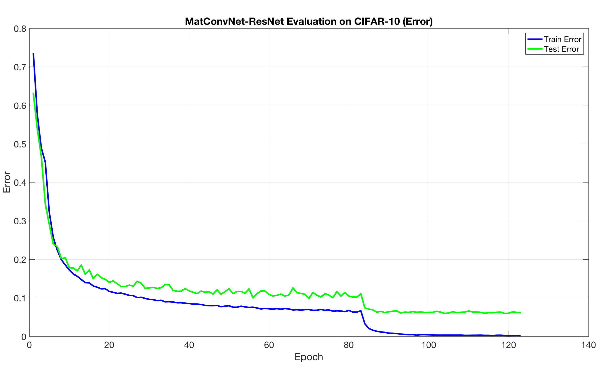
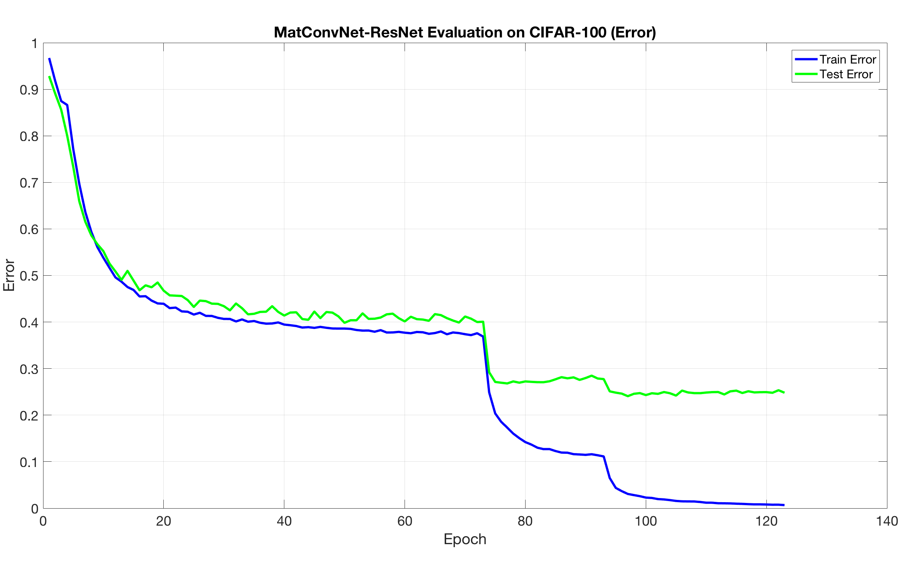

# MatConvNet Implementation for Deep Residual Networks 

This is a [MatConvNet](http://www.vlfeat.org/matconvnet) implementation of the work:

[He, Kaiming, et al., "Identity Mappings in Deep Residual Networks", arXiv:1603.05027 (2016)](http://arxiv.org/abs/1603.05027).


By [V. Belagiannis](http://www.robots.ox.ac.uk/~vb/) and [A. Gupta](http://www.robots.ox.ac.uk/~ankush/).


## Information

This implementation is based on the lua-code from  [Kaiming He's](https://github.com/KaimingHe/resnet-1k-layers) repository. The implementation has been evaluated only on CIFAR-10 and CIFAR-100.

0. The experiments have been conducted with the beta-20 version of [MatConvNet](https://github.com/vlfeat/matconvnet), which is included in the current project.

0. In this version of  [MatConvNet](https://github.com/vlfeat/matconvnet), *the momentum is stored* at the end of every epoch.

0. The code has been evaluated on CIFAR-10 and CIFAR-100 for depth 164. 

0. Sample architecture for a resnet created with a `depth` of 38 can be [found here](https://github.com/bazilas/matconvnet-ResNet/blob/master/sample-resnet-depth38.pdf).

## Usage

1. Compile [MatConvNet](https://github.com/vlfeat/matconvnet) from the ``matconvnet`` folder.
2. Execute the [``cnn_cifar()``](cifar/cnn_cifar.m) from the ``cifar`` folder (the parametrization follows below).
3. To train *CIFAR-10* with the *ResNet-164*, execute:

	```
	cnn_cifar('modelType', 'res', 'depth', 164, 'GPU', 1, 'batchSize', 128,'momentum', 0.95, 'weightDecay', 0.0001, 'Nclass', 10, 'learningRate', [0.01*ones(1,3) 0.1*ones(1,80) 0.01*ones(1,10) 0.001*ones(1,30)])
	
	```

4. To train *CIFAR-100* with the *ResNet-164*, execute:

	```
	cnn_cifar('modelType', 'res', 'depth', 164, 'GPU', 1, 'batchSize', 128,'momentum', 0.95, 'weightDecay', 0.0005, 'Nclass', 100, 'learningRate', [0.01*ones(1,3) 0.1*ones(1,70) 0.01*ones(1,20) 0.001*ones(1,30)])
	
	```

####Explanation for some parameters:
1. ``modelType`` (only residual model available, set value to: *res*)
2. ``depth`` (nework depth)
3. ``GPU`` (index for the GPU to be employed, set it to *[ ]* for CPU training) 
4. ``Nclass`` (10 for CIFAR-10 and 100 for CIFAR-100)
5. The ResNet implementation is in the file [``cifar/cnn_resnet_preact.m``](cifar/cnn_resnet_preact.m "cnn_resnet_preact.m")

## Experiments

The lowest error rates and the performance curves are given below:

|  Dataset  |  Error |
|:---------:|:------:|
|  CIFAR-10 |  5.98% |
| CIFAR-100 | 24.07% |

1.  CIFAR-10 error plot:

2.  CIFAR-100 Error Plot:


# MatConvNet: CNNs for MATLAB (Information)

**MatConvNet** is a MATLAB toolbox implementing *Convolutional Neural
Networks* (CNNs) for computer vision applications. It is simple,
efficient, and can run and learn state-of-the-art CNNs. Several
example CNNs are included to classify and encode images. Please visit
the [homepage](http://www.vlfeat.org/matconvnet) to know more.

**Lisence**: This code and MatConvNet are made available under the terms of the BSD license (see the COPYING file).
